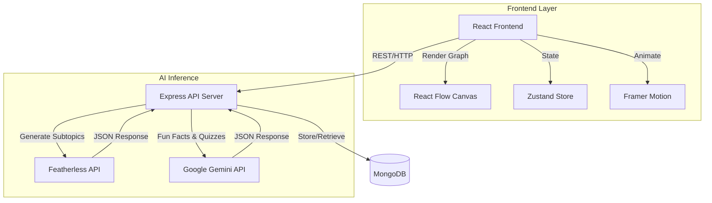

# FRACTAL


**FRACTAL** is an AI-powered knowledge exploration platform that turns any topic into an interactive mind map you can expand infinitely. Enter a subject, and the app generates a branching tree of subtopics with fun facts, then challenges your understanding with blizzard-themed mastery quizzes. The entire experience is wrapped in an immersive winter campfire scene with roaming bears, dynamic weather, and a warmth mechanic that gamifies learning.

Built for **TidalHack Spring 2026**.

---

## System Architecture

The application follows a client-server architecture with two AI providers (Featherless and Gemini) handling knowledge generation, and MongoDB caching responses to minimize redundant API calls.



---

## Features

- **Infinite Knowledge Trees**: Enter any topic and explore a branching mind map of subtopics generated by AI. Click any node to expand it further, as deep as you want.
- **Fun Fact Popups**: Hover over any node to see an educational fun fact about that topic.
- **Blizzard Mode Quizzes**: Mark a topic as "learned" to trigger a 5-question mastery quiz with a warmth survival mechanic -- answer correctly to stay warm, answer wrong and the cold creeps in.
- **Immersive Winter Scene**: A parallax campfire village background with animated roaming bears, falling snow particles, day/night toggle, and ambient wind synthesis.
- **Concepts History**: Revisit previously explored topics with their full tree structures preserved.
- **Response Caching**: All AI responses are cached in MongoDB with a 24-hour TTL to keep things fast and reduce API costs.

---

## Challenges

- Designing a tree layout algorithm that recursively positions subtrees without node overlaps as the graph scales to dozens of nodes
- Getting consistent, structured JSON output from the LLMs for subtopic generation, fun facts, and quiz questions
- Balancing the campfire SVG animations (flame flicker, roaming bears, snow particles) to feel alive without causing performance issues on the infinite canvas
- Integrating two different AI providers (Featherless via OpenAI SDK, Gemini via Google SDK) behind a unified service layer with graceful fallbacks
- Working with Tailwind v4's new CSS-first configuration, which breaks if you use the old v3 directive syntax

---

## Environment Setup

### Backend (server/.env)
```
FEATHERLESS_API_KEY=your_featherless_api_key
FEATHERLESS_MODEL=deepseek-ai/DeepSeek-V3.2
MONGODB_URI=mongodb://localhost:27017/fractal
PORT=3000
CLIENT_URL=http://localhost:5174
USE_GEMINI=true
GEMINI_API_KEY=your_gemini_api_key
```

---

## Getting Started

```bash
# Install dependencies
cd client && npm install && cd ..
cd server && npm install && cd ..

# Set up environment variables
cp server/.env.example server/.env
# Fill in FEATHERLESS_API_KEY, MONGODB_URI, and optionally GEMINI_API_KEY

# Run both servers
./scripts/start.sh
```

The frontend runs on `http://localhost:5174` and the API server on `http://localhost:3000`.

To clear the database:
```bash
./scripts/clear-db.sh
```
